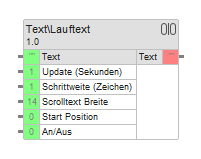

# Gira HomeServer - Lauftext

Logic for Gira HomeServer Scrolling Text.

## 1. How to install
1. Download the HSL File from https://github.com/sebastianfoth/gira-homeserver-lauftext/releases/tag/1.0
2. Open your "Gira Experte"
3. Import the downloaded HSL File as logic into "Gira Experte" and restart it
4. You can now use the logic in your graphical editor via `sebastianfoth\Text\Scroll Text` or `sebastianfoth\Text\Lauftext`

## 2. How to build this project manually

### 2.1 Prerequesites

- Make sure you are using Python 2.7

### 2.2 Steps

1. Get the Gira API Documentation from https://partner.gira.de/attachment/Schnittstelleninformationen_4685_1651045403.zip
2. Open the .zip file and copy the files from `Schnittstelleninformationen\HSL\HSL2 SDK 2.0.7\framework` into the root folder of this project
3. Run `python generator.pyc "lauftext" UTF-8`
4. Import the file `\projects\lauftext\release\1700_Lauftext.hsl` as Logic into "Gira Experte"

## 3. Coming Soon (tm)

1. Build Script for HSL File
2. Build Script for HSLZ File
3. Automated tests
4. Multiple Translations

## 4. License

MIT License

Copyright (c) 2024 Sebastian Foth - Software Solutions

Permission is hereby granted, free of charge, to any person obtaining a copy
of this software and associated documentation files (the "Software"), to deal
in the Software without restriction, including without limitation the rights
to use, copy, modify, merge, publish, distribute, sublicense, and/or sell
copies of the Software, and to permit persons to whom the Software is
furnished to do so, subject to the following conditions:

The above copyright notice and this permission notice shall be included in all
copies or substantial portions of the Software.

THE SOFTWARE IS PROVIDED "AS IS", WITHOUT WARRANTY OF ANY KIND, EXPRESS OR
IMPLIED, INCLUDING BUT NOT LIMITED TO THE WARRANTIES OF MERCHANTABILITY,
FITNESS FOR A PARTICULAR PURPOSE AND NONINFRINGEMENT. IN NO EVENT SHALL THE
AUTHORS OR COPYRIGHT HOLDERS BE LIABLE FOR ANY CLAIM, DAMAGES OR OTHER
LIABILITY, WHETHER IN AN ACTION OF CONTRACT, TORT OR OTHERWISE, ARISING FROM,
OUT OF OR IN CONNECTION WITH THE SOFTWARE OR THE USE OR OTHER DEALINGS IN THE
SOFTWARE.
